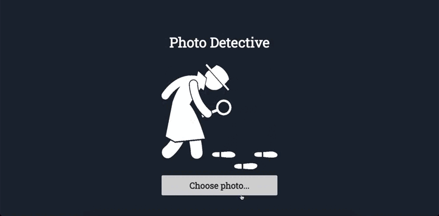

# Photo Detective
A tool to detect image insertions on photos using machine learning.

**Demo: https://photo-detective-front-3opm.vercel.app/**

Technologies: Python, Flask, Machine Learning, React, TypeScript, Next.js, HTML, CSS

Backend: https://github.com/TanyaIgnatenko/photo-detective

